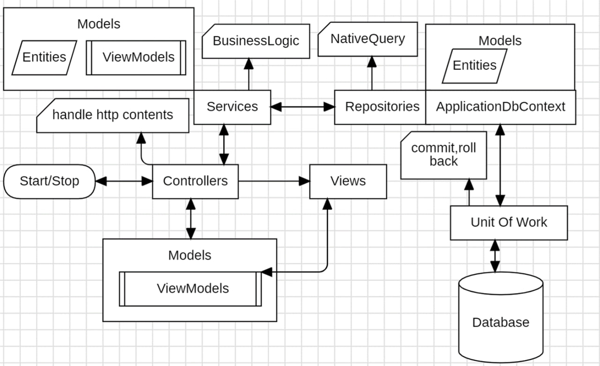
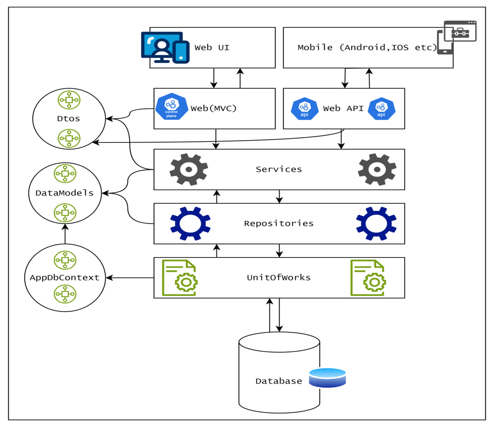
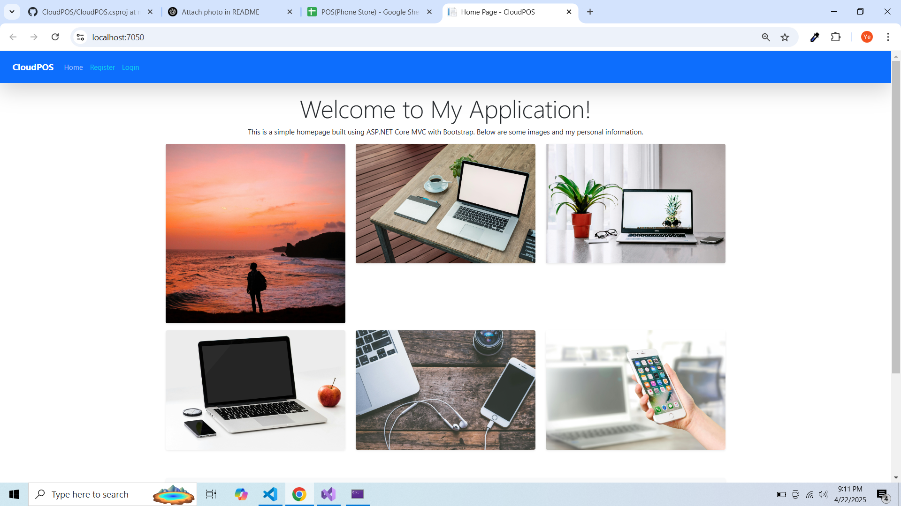
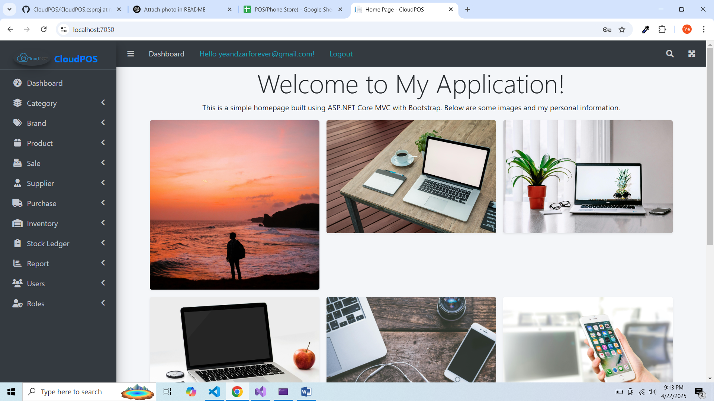
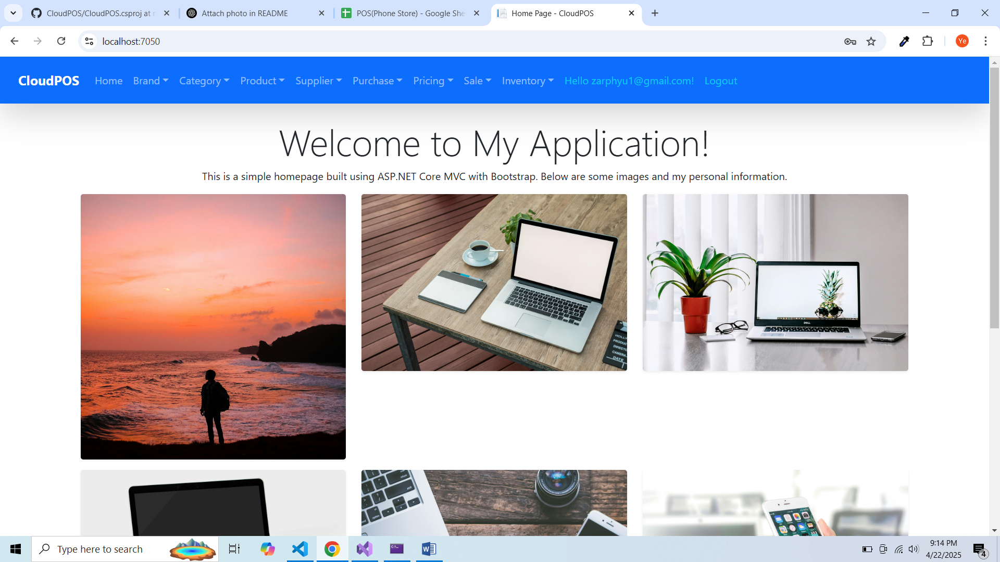

# CloudPOS
-Cloud POS is a cloud-based Point of Sale solution designed for seamless sales transactions and efficient stock management.Perfect for small and medim businesses as well as large enterprises, it ensures accurate tracking of inventory and sales, anytime and anywhere.Built to simplify workflows, enhance employee productivity and support business owners with quick and reliable tools for managing daily operations effictively.
# Application Architecture Diagram
- MVC with Repository & Unit Of Work Pattern

- MVC with monolithic Pattern

# Used Techonoligies
ASP.NET Core 8.0 MVC With Repository Architecture Pattern 
- ORM (Object Relational Mapper) With Entity Framework Core 9.0
- Authentication & Authorization With ASP.NET Core Identity Membership 
- UI/UX With Bootstrap 5.1 & JQuery 3.6
- Reportings With EPPlus Library  
- Data Storages With MS SQL Server 
- Admin Dashboard With AdminLTE ( crd : https://adminlte.io/)

# Database ERD Design
- [https://docs.google.com/spreadsheets/d/1YfYdncFPjrFlA_1R5d8tp4SHxiuL7xzKSgLKaNWWHhE/edit?usp=sharing]

# Functional Lists
- User/Role Management (Authentication vs. Authorization) according to roles.
- Category Management
- Brand Management 
- Supplier Management
- Product Management 
- Stock Management(stock balance & stock ledger)
- Purchase Order & Purchase Detail Process
- Sale Order & Sale Detail Process
- Reportings
- Dashboard for each role (Admin, Cashier)
 # Public User View
 
 # Admin View

 # Employee View
 